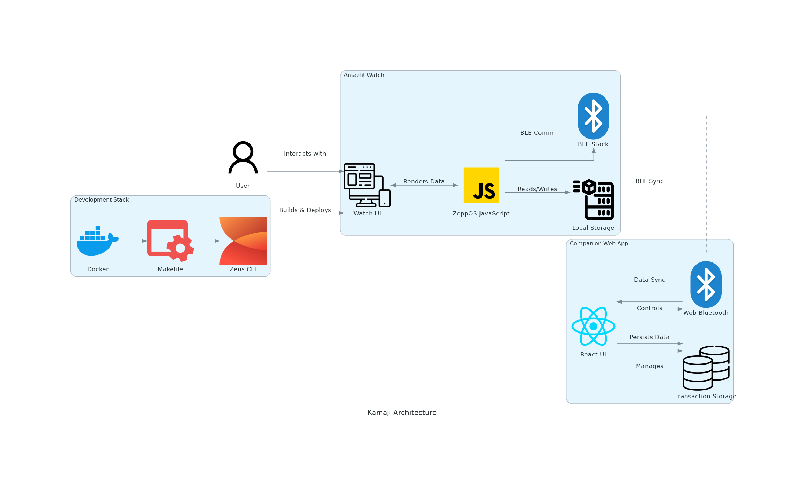
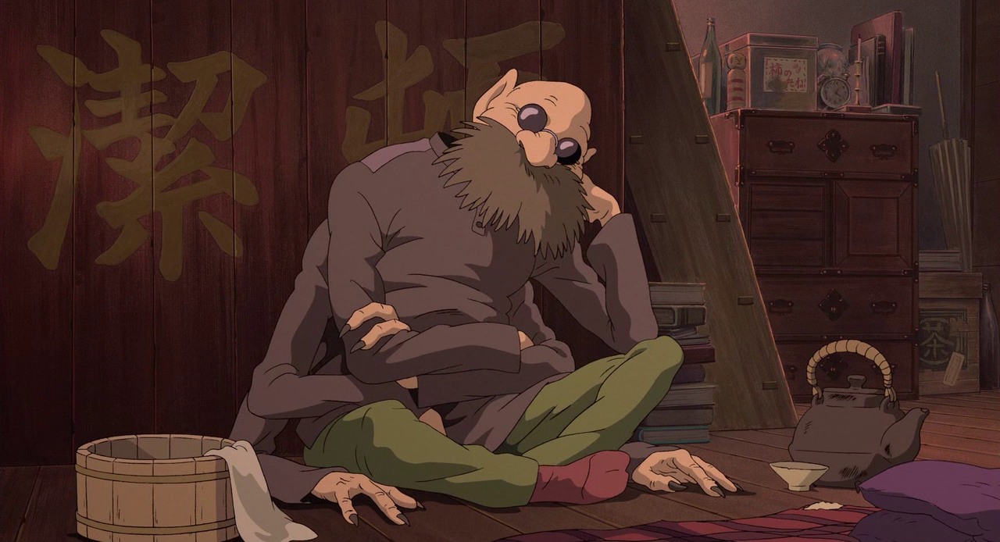

[](https://github.com/gongahkia/kamaji/releases/tag/1.0.0) 

# `Kamaji` 🏦

A Finance Manager application for your [Amazfit](https://www.amazfit.com/) watch.

`Kamaji` is served as both a [Watch Application](./watch-app/) and a [Companion Web App](./companion-app/), synced via the [BLE](https://en.wikipedia.org/wiki/Bluetooth_Low_Energy) communication protocol.

## Stack

* *Frontend*: [React](https://react.dev/)
* *Script*: [JavaScript](https://developer.mozilla.org/en-US/docs/Web/JavaScript)
* *Package*: [Docker](https://www.docker.com/)
* *SDK*: [Zepp OS SDK](https://docs.zepp.com/docs/guides/tools/cli/overview/), [Zepp OS Simulator](https://docs.zepp.com/docs/guides/tools/simulator/download/) (provisioned by Zepp Health)
* *Protocol*: [Web Bluetooth API](https://developer.mozilla.org/en-US/docs/Web/API/Web_Bluetooth_API)

## Usage

The below instructions are for locally hosting `Kamaji`.

1. Execute the following.

```console
$ git clone https://github.com/gongahkia/kamaji && cd kamaji
$ docker-compose up --build
```

2. Then run one of the below.
    1. Run `make logs` to view build logs.
    2. Run `make clean` to clean up Docker Containers.
    3. Run `make deep-clean` to remove all Docker Volumes, JavaScript node_modules, and other build artifacts.
    4. Run `make build-watch WATCH_PLATFORM=build_platform` to build the Watch App for a specific Zepp OS-compatible device.
    5. Run `make emulate-watch WATCH_PLATFORM=gtr4` to run the Zepp OS emulator.
    6. Run `make companion-shell` to run the Companion Web App.

## Architecture



## Reference

The name `Kamaji` is in reference to [Kamajī](https://ghibli.fandom.com/wiki/Kamaj%C4%AB) (釜爺), the six-armed elderly man who operates the boiler room of [Yubaba](https://ghibli.fandom.com/wiki/Yubaba)'s [Bathhouse](https://ghibli.fandom.com/wiki/Bathhouse) and assists [Chihiro](https://ghibli.fandom.com/wiki/Chihiro_Ogino) in the acclaimed [Studio Ghibli](https://ghibli.fandom.com/wiki/Studio_Ghibli) film, [Spirited Away](https://ghibli.fandom.com/wiki/Spirited_Away).

<div align="center">
    
</div>